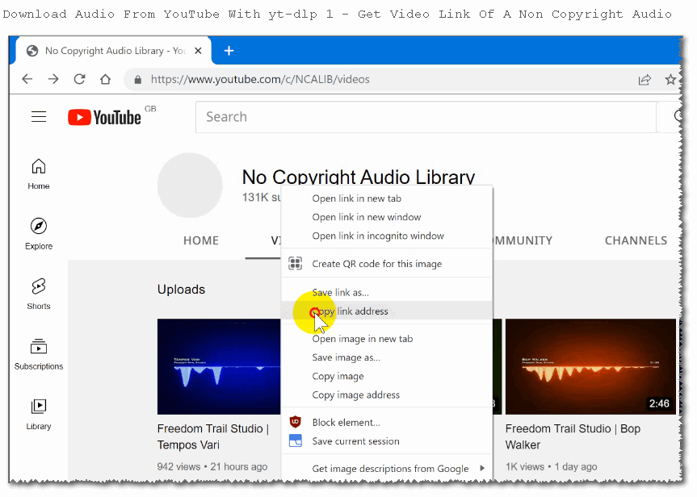
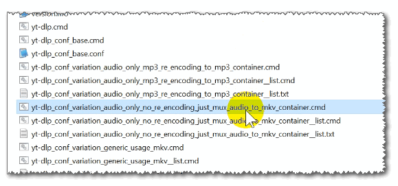
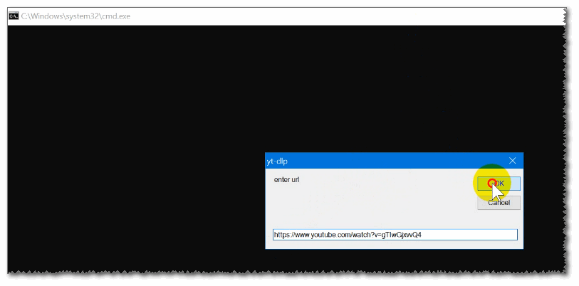
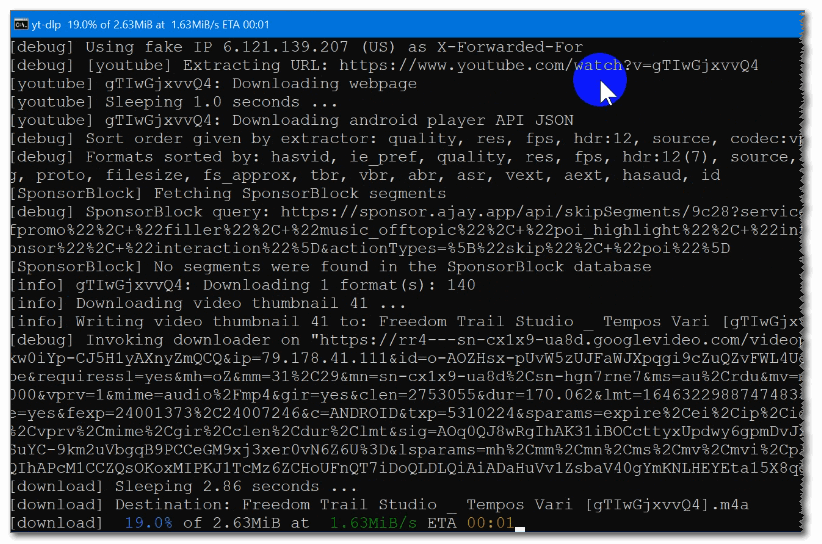
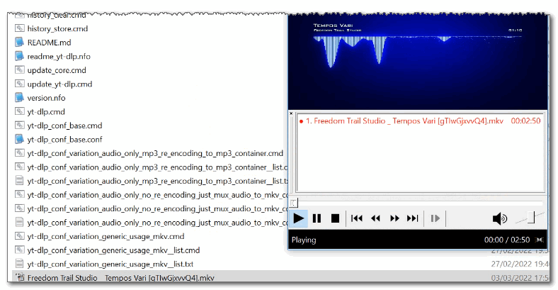
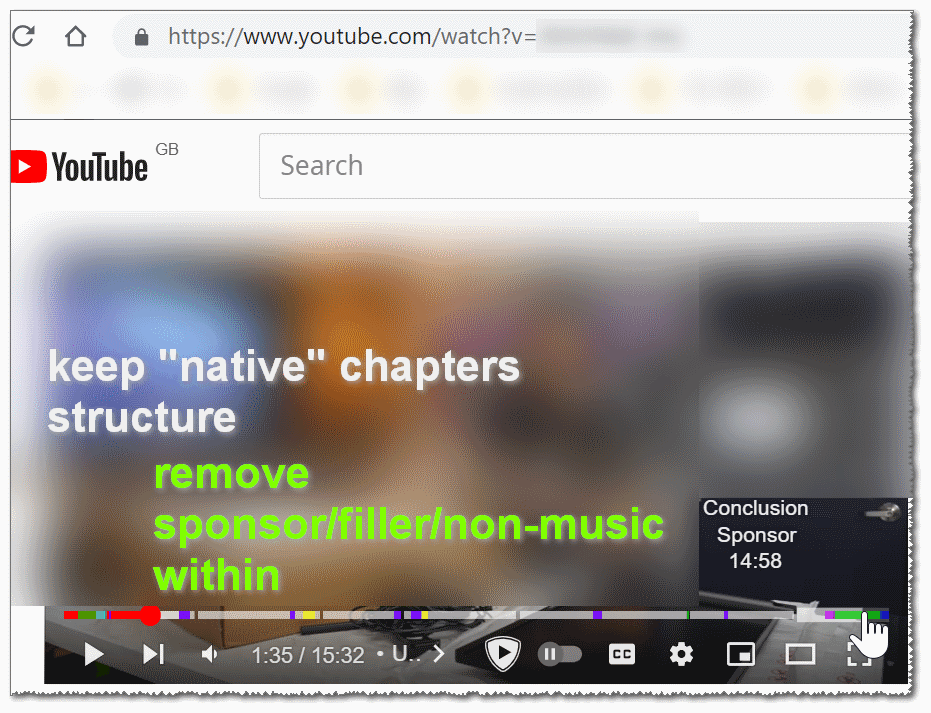
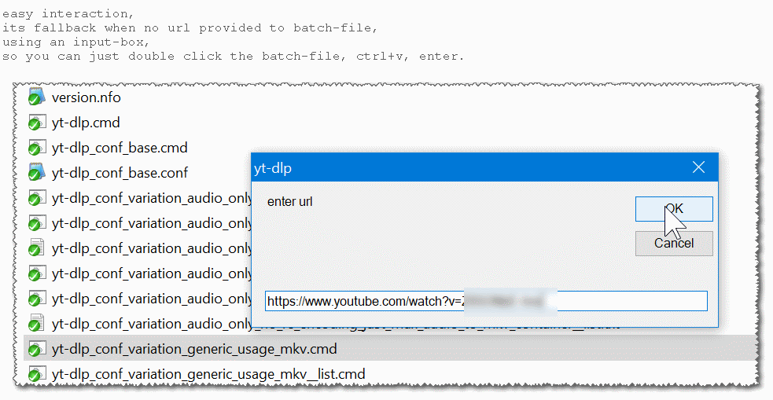
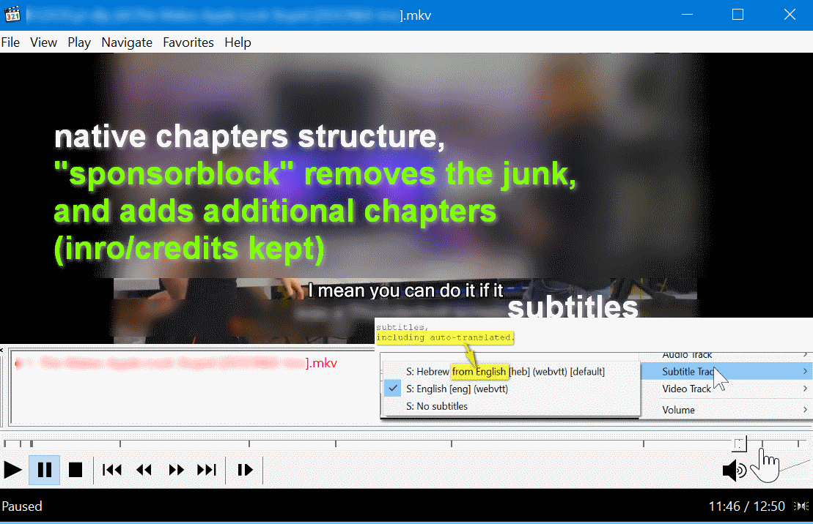

<h1>yt-dlp Kit (all included)</h1>


a <a href="https://github.com/yt-dlp/yt-dlp">yt-dlp</a> kit,  
all dependencies included (python too).  
portable.  
updatable.  
ready to use.  
download, and unzip anywhere (including disk-on-key/flash-drive).  
https://github.com/eladkarako/yt-dlp_kit/archive/refs/heads/master.zip  

<hr/>

<br/>
<br/>
<br/>

<hr/>

<br/>

<br/>

<br/>

<br/>

<br/>


<hr/>

<br/>

<br/>

<br/>


<br/>
<br/>


<br/>

examples.  

<details><summary>batch files to "download stuff"</summary>

`yt-dlp.cmd` is the entry point to access `yt-dlp` it uses the python library with python execute directly without using `yt-dlp.exe`.  


the batch files are just an example-files, showing you how to add functionality on top of `yt-dlp.cmd`.

<hr/>

`yt-dlp_conf_base.cmd` includes useful arguments  
(it loads most of them from `yt-dlp_conf_base.conf`)  
if you run it by itself (no arguments) it will pop an input-box,  
to make it easy for you to just paste a URL.

<details name="example-about-history" id="example-about-history"><summary>it also adds (local) history.</summary>

whatever arguments included will be dumped into `history.txt`,  
along with date and time. newest entry is on top.

here is an example for an entry (the date-time format might change depanding on your machine):

```txt
-=-=-=-=-=-=-=-=-=-==-=-=-=-=-  
2022/03/14 20:39                
"https://www.youtube.com/watch?v=example1234" --ignore-config --config-location "D:\Software\yt-dlp_kit\yt-dlp_conf_base.conf" --format "bestaudio[ext=m4a]/bestaudio/best" --extract-audio --merge-output-format mkv --remux-video mkv                             
                               
-=-=-=-=-=-=-=-=-=-==-=-=-=-=-  
```

the line responsible to this is:  
`call "%~sdp0\history_store.cmd" %ARGS% %*`  
around line ~57, in `yt-dlp_conf_base.cmd`.  

you may remove this line if you do not wish to generate `history.txt` file.

this is an example, and the history is only stored localy for you.  

I know `yt-dlp` has `--download-archive` feature that stores the video-id,  
but I don't want to use it, and it does not provide real "history" such as this one.

you can delete the `history.txt` or run `history_clear.cmd` (same).  
you can use `history_store.cmd` to add entries to the local `history.txt`.

</details>


it does not includes a specific `--format`,  
so implicitly using it will use `--format=best`.

it has no explicit file extension or container,  
so if the source is mp4, you will get mp4 file,  
which might not support all the features that well,  
I suggest using `yt-dlp_conf_variation_generic_usage_mkv.cmd`,  
it is basically the same but force everything into mkv file at the end.  

=-=-=  

the next batch files add command-line arguments 'on top' of `yt-dlp_conf_base.cmd`.

=-=-=  

`yt-dlp_conf_variation_audio_only_mp3_re_encoding_to_mp3_container.cmd`  
will generate audio-only mp3, in mp3 file.  
if no audio only is available it will rip the audio stream from a Audio/Video file.  
if no mp3 stream is available it will re-encode whatever audio it has (ogg/m4a/..) into mp3.  
the end result is a mp3 stream in mp3 file (container),  
it should work nicely with old MP3-players.  

=-=-=  

`yt-dlp_conf_variation_audio_only_mp3_re_encoding_to_mp3_container__list.cmd`  
and `yt-dlp_conf_variation_audio_only_mp3_re_encoding_to_mp3_container__list.txt`  
are examples on how to use a list.  

=-=-=  

`yt-dlp_conf_variation_audio_only_no_re_encoding_just_mux_audio_to_mkv_container.cmd`  
will (also) get audio only,  
if there is no audio-only stream it will rip the audio from Audio/Video file.  

it will not re-encode the stream, just pack it into a mkv file.
it is really fast but best for audio you want to keep in your computer.  

=-=-=  

`yt-dlp_conf_variation_audio_only_no_re_encoding_just_mux_audio_to_mkv_container__list.cmd`  
and `yt-dlp_conf_variation_audio_only_no_re_encoding_just_mux_audio_to_mkv_container__list.txt`  
are an example for using a list.

=-=-=  

`yt-dlp_conf_variation_generic_usage_limit_to_720p_prefer_m4a_audio_no_re_encoding_just_mux_all_to_mkv.cmd`  
has a `--format` that limits the maximum resolution to 720p,  
it also favors a Audio/Video MP4 file first (but will fallback to whatever available),  
it also favors `m4a` for audio (again, will will fallback to whatever audio available).

this works really well in old YouTube videos,  
MP4 will download really fast since it is stored in a different way than new YouTube videos,  
and it works well with aria2c too. and there is no need to mux (combine) the streams afterwards.

the 720p limit is my own preference,  
it is sufficient for laptop screens and keeps a moderate file-size,  
also, 720p is the maximum resolution where a Audio/Video MP4 was available (known as resource `36`).

it will put whatever it gets into a mkv file.  

=-=-=  

`yt-dlp_conf_variation_generic_usage_limit_to_720p_prefer_m4a_audio_no_re_encoding_just_mux_all_to_mkv__list.cmd`  
and `yt-dlp_conf_variation_generic_usage_limit_to_720p_prefer_m4a_audio_no_re_encoding_just_mux_all_to_mkv__list.txt`  
are example on how to use a list.  

=-=-=  

`yt-dlp_conf_variation_generic_usage_mkv.cmd` will just download whatever you give it into a mkv file,  
it has no `--format` and it is basically just `yt-dlp_conf_base.cmd` with added "put it into mkv" instruction.

this is the most useful batch file,  
the mkv works well with subtitles, thumbnails, chapters and any media stream.  
but it will not work well in old players.

=-=-=  

`yt-dlp_conf_variation_generic_usage_mkv__list.cmd` and  
`yt-dlp_conf_variation_generic_usage_mkv__list.txt` are  
examples on how to use a list.  

</details>


<hr/>

just in-case you've missed reading above,  
the example file `yt-dlp_conf_base.cmd` has <a href="#user-content-example-about-history">a local history feature</a>.

<hr/>

<details><summary>updating the kit</summary>

`update_yt-dlp.cmd` will install the bleeding-edge `yt-dlp` from the github master branch (newer than a release),  
it will also re-install the `yt-dlp` python-package dependencies (`requirements.txt`).  
this is a forced-install,  
every time you will run it - it will download and install `yt-dlp` (and `requirements.txt` dependencies),  
even if that is the same version.  
after that it will update `readme_yt-dlp.nfo` with all the arguments available (`--help`)  
and `version.nfo` with the current version of `yt-dlp`.  
`version.nfo` has other useful information such as the depenencies that `yt-dlp` has found out that are available - both python packages and external depenencies (`ffmpeg`, `phantomjs`, ..),  
it is very useful to debug stuff.

<hr/>

do not use `update_core.cmd`.  

`update_core.cmd` will try to update python packages using `pip`,  
starting with updating `pip` itself,  
it will use `pip-review` (https://github.com/jgonggrijp/pip-review)  
in interactive mode, to try to update other packages,  
but I have found that it breaks stuff.

</details>

<hr/>

<details><summary>debug stuff</summary>

`yt-dlp` runs directly from it python code in `/resources/WPy32/python-3.10.2/Lib/site-packages/yt_dlp/`.  
the WinPython is portable, but to run a batch file that uses it, it requires a lot of environment variables,  
I've already set those, and things should be fine..  

but just in case - I've added `cmd.cmd` .  

running `cmd.cmd` would set all the environment variables as running `yt-dlp.cmd` would,  
but it keeps the command-line open,  
so you can run command such as `echo %PATH%`, or `where curl.exe`, or `where python`,  
to make sure your system has not overrided the (for example) python to your own installation,  
or (for example) `curl.exe` to `C:\Windows\System32\curl.exe`. 

you can just close the window when you'll finish.
</details>

<hr/>

kit includes:
1. WinPython `32-3.10.2.0dot` (the x86 version, for maximum compatibility). it is portable by default. yt-dlp is installed in `/resources/WPy32/python-3.10.2/Lib/site-packages/yt_dlp/` (using pip - `(python) -m pip install --force-reinstall https://github.com/yt-dlp/yt-dlp/archive/master.zip`. the same command is also used to update to latest version).
2. various requirements were pre-compiled and installed (`mutagen` (`pip install mutagen`), `pycryptodomex` (`pip install pycryptodomex`), `websockets` (`pip install websockets`)).
3. a <a href="https://github.com/nanake/ffmpeg-tinderbox/releases/download/build-2022-03-12-21-24-n105916/ffmpeg-N-105916-gdf8163ae55-win32-nonfree.7z">better version of FFMPEG</a> (not the one that yt-dlp suggests). it contains all the patches of the suggested version, but also includes a lot of non-free codecs.
4. wGet, curl, Aria2C.
5. AtomicParsly.
6. PhantomJS.
7. RTMPDump.
8. <del>mplayer</del> <sup>ffmpeg&nbsp;is&nbsp;better</sup>.
9. <del>mpv</del> <sup>ffmpeg&nbsp;is&nbsp;better</sup>.
10. inputbox-GUI, to pop whenever no arguments were provided, so you can easily paste URLs without the need to interact with CMD.

additional includes:  

11. wrapping scripts to provide the main functionality.
12. updating script that keeps yt-dlp updated from trunk (master). it also updates some python packages and the latest extended help section.


whenever possible a config file is being used,  
to reduce the amount of command line arguments.

whenever possible, binaries were modified to run properly on Windows10+.

environment variables, and locations of dependencies are already configured for yt-dlp.  
relative paths are being used. no registry values are written or being read.  

you can the kit in your disk-on-key drive and it will work just fine.

<hr/>

optional.

support for long paths (over 260 characters) is possible in Windows10.  
if you don't need it, nevermind.

I've already modified all the binaries (python, packages, dependencies) to include `longPathAware` in their manifest,  
but Windows10+ needs to apply a registry patch as explained in here: https://docs.microsoft.com/en-gb/windows/win32/fileio/maximum-file-path-limitation?tabs=cmd#enable-long-paths-in-windows-10-version-1607-and-later  

```reg
Windows Registry Editor Version 5.00

[HKEY_LOCAL_MACHINE\SYSTEM\CurrentControlSet\Control\FileSystem]
"LongPathsEnabled"=dword:00000001
```

<hr/>

some of the binaries were not being able to be modified,  
so I've included a `manifest` file in the same folder (also known as a 'side-by-side' manifest),  
it should override any manifest resource embedded in the binaries,  
providing a slightly faster run.

Windows7 will not use an external manifest if an embedded one already exists,  
so you (optionally) need to apply the following registry patch:  

```reg
Windows Registry Editor Version 5.00

[HKEY_LOCAL_MACHINE\SOFTWARE\Microsoft\Windows\CurrentVersion\SideBySide]
"PreferExternalManifest"=dword:00000001
```

<hr/>

note: everything is x86 to allow it to run on both x64 and x86 machines, 
AtomicParsley and PhantomJS (optional dependencies) are x64.  
that's fine. you normally don't need it. you can comment-out (remove) the pre-definition of those binaries (in PATH) in the CMD-files under `/resource/` folder, this way `yt-dlp` will not use them.

<hr/>

when uncompressed, there are some big files in this repository
ffmpeg + ffprobe + ffplay = ~184MB (each is ~64MB, static build).
phantomjs = ~74MB.
winpython = ~95MB.

<hr/>

this kit contains multiple binaries with various licenses (mostly GNU),  
anything I've wrote is Public Domain (The UnLicense).

<hr/>

you are advised to pre-check everything with anti-virus,  
and/or run in a virtual-machine. 

<hr/>

this project is archived for the sake of being read-only.  
there are no releases.

<hr/>

`yt-dlp.cmd` is used to call `yt-dlp`. this is your starting point and you can "build on top of that".

example batch-scripts are provided, to ease you usage:  

`yt-dlp_conf_base.cmd` is an example that uses a config file with some workarounds and useful switches it stores the arguments in `history.txt` generated for you, it does not includes specific formats so if you'll use it will will default to the format `"best"` of whatever you'll be giving it.  

the provided configuration in `yt-dlp_conf_base.conf` (you can change that) tries to get subtitles in Hebrew and English (you can change that), even auto-generated ones, thumbnails, chapters and useful data such as video description.  

it uses sponsorblock correctly to remove `"sponsor,selfpromo,interaction,filler,music_offtopic"` and mark (without removing) `"intro,outro,poi_highlight"` so you can jump to it using your media-player.  

other than that it works around certificate errors and continue work through errors. it also outputs extended information to the console.


`yt-dlp_conf_variation_generic_usage_mkv.cmd` is my go-to download starting point, it adds to `yt-dlp_conf_base.cmd` a limiting format of up to 720p videos, favoring MP4 that has audio-video integrated already (old youtube videos still uses that), it fallback to the default `"best"` format so you can use it anywhere really. it also mux (not re-encode) everything into modern MKV container which can host subtitles, chapters, thumbnails and a lot of data.

two other batch files are used to download audio only are `yt-dlp_conf_variation_audio_only_mp3_re_encoding_to_mp3_container.cmd` which generates compatible mp3 audio files for old-MP3 players. it uses mp3 container which has limited support for suff like chapters or thumbnails.

`yt-dlp_conf_variation_audio_only_no_re_encoding_just_mux_audio_to_mkv_container.cmd` is used if you want to download audio to your computer (for example), the MKV modern container can handle pretty much any additional streams and data, including chapters. it will not re-encode the audio but simply mux it into the container, so it will work pretty fast (as fast you can download).

`yt-dlp_conf_variation_generic_usage_mkv__list.cmd`  
`yt-dlp_conf_variation_audio_only_mp3_re_encoding_to_mp3_container__list.cmd`  
`yt-dlp_conf_variation_audio_only_no_re_encoding_just_mux_audio_to_mkv_container__list.cmd`  
are example batch files that use the respecful batch-files to download from provided list (text-file).

<hr/>

`history.txt` is a text file that will be generated after you'll use `yt-dlp_conf_base.cmd` it keeps the arguments sent to it.  
`history_store.cmd` is the writer, it generates a data-time and keeps new data on top.
`history_clear.cmd` is simply a call to `del /f /q "history.txt"`.
this is for your own usage only, `history.txt` is included in `.gitignore` should it should not be included in the repository,  
and you can always either nullified the `history_store.cmd` file or comment-out (remove) `call "%~sdp0\history_store.cmd" %ARGS% %*` (around line 57, from `yt-dlp_conf_base.cmd`).

<hr/>

`update_core.cmd` will update python pip modules, it will use an interactive yes, no, all for each (all will answer yes to all).
yt-dlp should be fine with most. it uses pip own upgrade method as well as https://github.com/jgonggrijp/pip-review (included). this sometimes includes VC-runtime. you don't need to run this if everything work well. if you choose to run this I also advise to run the `update_yt-dlp.cmd` as well, make sure it uses `call "%STARTING_FOLDER%\resources\WPy32\python-3.10.2\python.exe" -m pip install --force-reinstall "https://github.com/yt-dlp/yt-dlp/archive/master.zip"` to re-build everything new.


`update_yt-dlp.cmd` will update yt-dlp and all its dependencies in https://github.com/yt-dlp/yt-dlp/blob/master/requirements.txt  

it uses `pip` and the provided python. it uses force installation to fix potential issues with older installations, so even if you already have some of the dependencies it will download and re-install them. it also uses yt-dlp from latest github repository build (not a release). you can edit the script to comment out `call "%STARTING_FOLDER%\resources\WPy32\python-3.10.2\python.exe" -m pip install --force-reinstall "https://github.com/yt-dlp/yt-dlp/archive/master.zip"` and uncomment (remove `::`) from `::call "%STARTING_FOLDER%\resources\WPy32\python-3.10.2\python.exe" -m pip install -U yt-dlp` for normal release.

at the end it will also update a `readme_yt-dlp.nfo` which includes the `--help` entries, and a `version.nfo` that include the output of the program with only `--verbose` argument, which provides information regarding the program itself and its dependencies, I trim down some extra text around. it's useful to debug things.


<hr/>

once you've downloaded the project you can keep the python pip modules, dependencies and yt-dlp itself updated with the update batch files, there is no need to re-download the whole thing again.

<hr/>

`cache_clear.cmd` will clear temp folders (including `resources/TEMP/` folder and its content), partial installations and python cache folder and files.
those will rebuilt. you can run this batch file any time you want.

`update_core.cmd` (which you should not use) and `update_yt-dlp.cmd` will call it before running anything.

it does not have a pause at the end (since other batch files use it) so if you want to see what has been removed uncomment the `::pause` (to just `pause`) at the end of the file (don't forget to comment it out back when you've finished).

<hr/>

the `cmd.cmd` provided an easier way to debug environment variables correct assignment,  
it is essentially just opens up `call "%SystemRoot%\System32\cmd.exe" /E:ON /F:ON /V:ON /U /K` after setting the entire set of environment settings that makes python works, and the paths to the dependencies that yt-dlp uses.
by using `/K` in `cmd` I'm making sure the command stays. this way I can debug a lot of things...

for example running `where curl` will give me (on my current location which is under `D:\Software\yt-dlp_kit`:

```txt
D:\Software\yt-dlp_kit\resources\curl\curl.cmd
D:\Software\yt-dlp_kit\resources\curl\curl.exe
C:\Windows\System32\curl.exe
```

this helps me know that ambigious call to curl will use the first line `D:\Software\yt-dlp_kit\resources\curl\curl.cmd` and explicit call to `curl.exe` (not path provided) will call to `D:\Software\yt-dlp_kit\resources\curl\curl.exe` which is a specially modified curl version from https://community.chocolatey.org/api/v2/package/curl/7.80.0 and not the old Windows one..

eventually, to quit, you can just close the `cmd` window (or type `exit`).

<hr/>

you can get more information visiting folders under `/resources/` (for example `/resources/curl/`) each should have a `README.md` with more details on the specific build and modification that were applied over.

<hr/>


<hr/>

if you want to support the `yt-dlp` project head over to the project page at https://github.com/yt-dlp/yt-dlp  

if you want to support this project you can use <a href="https://paypal.me/%65%31%61%64%6B%61%72%61%6B%30/%35%55%53%44" rel="nofollow">this</a>.
